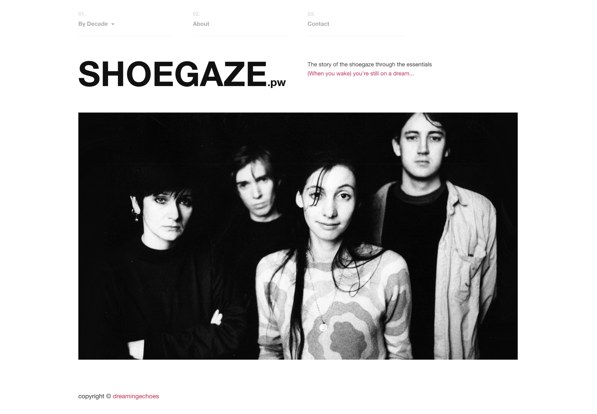

# Shoegaze.pw

## About

Shoegaze.pw is a (work in progress) simple website with [Middleman](https://middlemanapp.com/) and jQuery to show the story of the shoegaze through the essentials.



## Usage

To use this example, first you have to install **Middleman** in order to be able to initialize a server. Just follow the instructions provided [here](https://middlemanapp.com/basics/install/).

Then, you're ready to go, simply execute this on your terminal:

```sh
user@computer:~$ git clone git@github.com:dreamingechoes/shoegaze.pw.git
user@computer:~$ cd shoegaze.pw
user@computer:/shoegaze.pw$ bundle install
user@computer:/shoegaze.pw$ middleman serve
```

## Contributing

Bug reports and pull requests are welcome on GitHub at https://github.com/dreamingechoes/shoegaze.pw. This project is intended to be a safe, welcoming space for collaboration, and contributors are expected to adhere to the [Contributor Covenant](contributor-covenant.org) code of conduct.

## License

**Shoegaze.pw** is released under the terms of the [MIT License](http://opensource.org/licenses/MIT).
